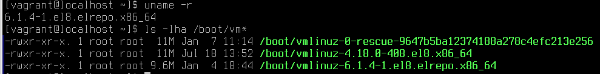
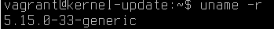
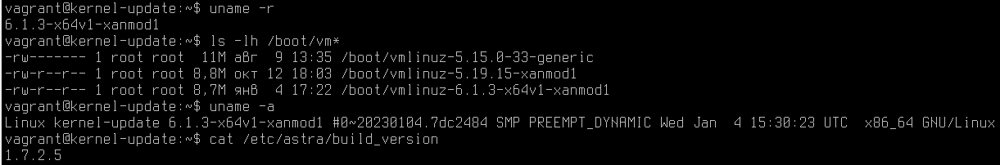

# Домашнее задание к занятию 1.1 "Vagrant-стенд для обновления ядра и создания образа системы"
https://docs.google.com/document/d/12sC884LuLGST3-tZYQBDPvn6AH8AGJCK

## Описание домашнего задания
1) Обновить ядро ОС из репозитория ELRepo
2) Создать Vagrant box c помощью Packer
3) Загрузить Vagrant box в Vagrant Cloud

Дополнительные задания:
    Ядро собрано из исходников
    В образе нормально работают VirtualBox Shared Folders

---

## Задача 1. Обновить ядро ОС из репозитория ELRepo

Ядро после замены:    

По производственным мотивам так же был проведен опыт с ОС Astra Linux SE 1.7.2.

Оригинально ядро до замены:    

После замены на xanmod:    

## Задача 2. Создать Vagrant box c помощью Packer

Конфигурация packer и kickstart для centos 8:    
[/packer](./packer/)

## Задача 3. Загрузить Vagrant box в Vagrant Cloud

Box в Vagrant Cloud:    
https://app.vagrantup.com/biryukov_tv/boxes/centos8-kernel6

Vagrantfile для развертывания данного образа:    
[Vagrantfile](Vagrantfile)
