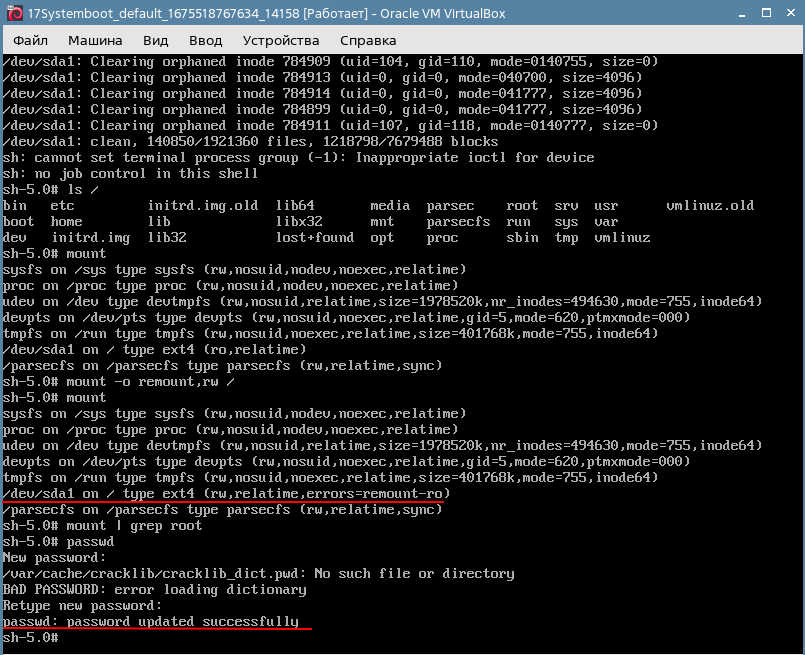
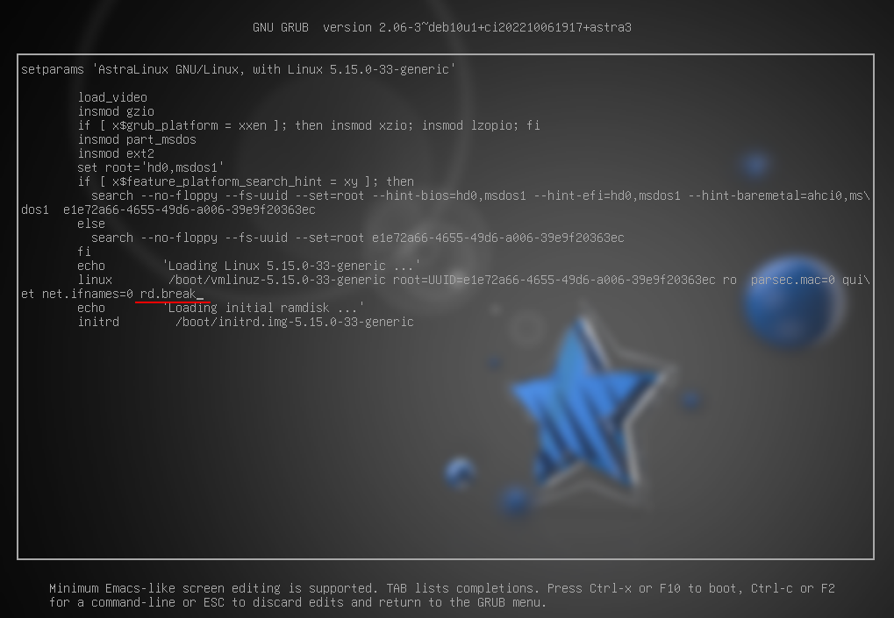
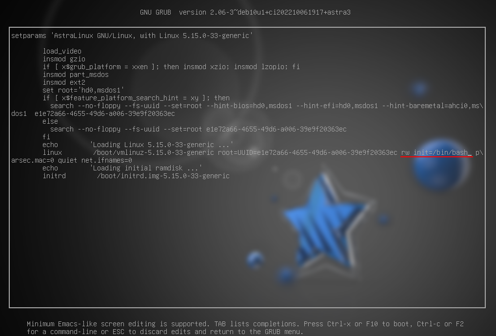
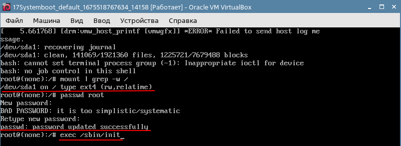
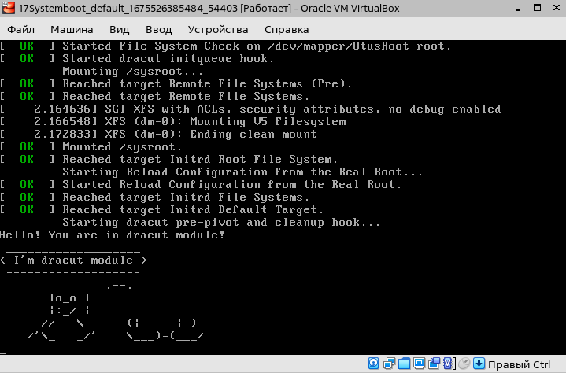

# Домашнее задание к занятию 1.7 "Работа с загрузчиком"
https://drive.google.com/file/d/1-lfwAa6hOC-HVF2Agz9tj21vtKFyjDq7/view?usp=share_link


## Описание домашнего задания

Основная часть:    
1. Попасть в систему без пароля несколькими способами.
2. Установить систему с LVM, после чего переименовать VG.
3. Добавить модуль в initrd.
Задание со звездочкой:    
Сконфигурировать систему без отдельного раздела с /boot, а только с LVM
Репозиторий с пропатченым grub: https://yum.rumyantsev.com/centos/7/x86_64/
PV необходимо инициализировать с параметром --bootloaderareasize 1m

---


## 1. Попасть в систему без пароля несколькими способами

Для экспериментов был выбран дистрибутив Astra Linux 1.7.3.

Способ 1. init=/bin/sh    
В конце строки `linux...` (загрузка ядра с параметрами) добавляем `init=/bin/sh` и нажимаем `сtrl-x` для загрузки в систему:    
    


Способ 2. rd.break
В конце строки `linux...` (загрузка ядра с параметрами) добавляем `rd.break` для прерывания последовательность запуска и нажимаем `сtrl-x` для загрузки в систему:    
    

Это не сработало т.к. Astra Linux в основе имеет debian и в нем вместо `dracut`, создающего initramfs, используется `update-initramfs`.

Способ 3. rw init=/sysroot/bin/sh
В конце строке `linux...` (загрузка ядра с параметрами) заменяем `ro` на `rw init=/sysroot/bin/sh` для Red Hat based дистрибутивов, в нашем случае с debian like дистрибутивами `rw init=/bin/bash` и `сtrl-x` для загрузки в систему:    
    
    

В целом то же самое, что и в прошлом примере, но файловаā система сразу смонтирована в режим Read-Write.    
`exec /sbin/init` позволяет продолжить загрузку ОС, после чего можно входить с новым паролем.

## 2. Установить систему с LVM, после чего переименовать VG  

```bash
[root@centos7 vagrant]# lsblk
NAME                    MAJ:MIN RM  SIZE RO TYPE MOUNTPOINT
sda                       8:0    0  128G  0 disk 
├─sda1                    8:1    0    1G  0 part /boot
└─sda2                    8:2    0  127G  0 part 
  ├─centos_centos7-root 253:0    0  125G  0 lvm  /
  └─centos_centos7-swap 253:1    0    2G  0 lvm  [SWAP]

[root@centos7 vagrant]# vgs
  VG             #PV #LV #SN Attr   VSize    VFree
  centos_centos7   1   2   0 wz--n- <127,00g    0 

# Приступим к переименованию:
[root@centos7 vagrant]# vgrename centos_centos7 OtusRoot
  Volume group "centos_centos7" successfully renamed to "OtusRoot"

# Далее правим /etc/fstab, /etc/default/grub, /boot/grub2/grub.cfg. Везде заменяем старое название на новое:
[root@centos7 vagrant]# sed -i 's/centos_centos7/OtusRoot/g' /etc/fstab /etc/default/grub /boot/grub2/grub.cf

# Пересоздаем initrd image, чтобы он знал новое название Volume Group
[root@centos7 vagrant]# mkinitrd -f -v /boot/initramfs-$(uname -r).img $(uname -r)
Executing: /sbin/dracut -f -v /boot/initramfs-3.10.0-1160.80.1.el7.x86_64.img 3.10.0-1160.80.1.el7.x86_64
dracut module 'modsign' will not be installed, because command 'keyctl' could not be found!
...
*** Creating image file ***
*** Creating image file done ***
*** Creating initramfs image file '/boot/initramfs-3.10.0-1160.80.1.el7.x86_64.img' done ***

[root@centos7 vagrant]# reboot

[root@centos7 vagrant]# vgs
  VG       #PV #LV #SN Attr   VSize    VFree
  OtusRoot   1   2   0 wz--n- <127,00g    0 

[vagrant@centos7 ~]$ lsblk
NAME              MAJ:MIN RM  SIZE RO TYPE MOUNTPOINT
sda                 8:0    0  128G  0 disk 
├─sda1              8:1    0    1G  0 part /boot
└─sda2              8:2    0  127G  0 part 
  ├─OtusRoot-root 253:0    0  125G  0 lvm  /
  └─OtusRoot-swap 253:1    0    2G  0 lvm  [SWAP]

```

## 3. Добавить модуль в initrd

Скрипты модулей хранятся в каталоге `/usr/lib/dracut/modules.d/` для Red Hat based дистрибутивов, в случае с debian like дистрибутивами `/lib/modules/`.

```bash
#  Длā того чтобы добавить свой модуль создаем там папку с именем 01test:
[root@centos7 vagrant]# mkdir /usr/lib/dracut/modules.d/01test

# В нее поместим два скрипта:
[root@centos7 vagrant]# touch /usr/lib/dracut/modules.d/01test/module-setup.sh

[root@centos7 vagrant]# cat > /usr/lib/dracut/modules.d/01test/module-setup.sh << EOF
#!/bin/bash
check() {
    return 0
}
depends() {
    return 0
}
install() {
    inst_hook cleanup 00 "/usr/lib/dracut/modules.d/01test/test.sh"
}
EOF

[root@centos7 vagrant]# chmod +x /usr/lib/dracut/modules.d/01test/module-setup.sh

[root@centos7 vagrant]# touch /usr/lib/dracut/modules.d/01test/test.sh

[root@centos7 vagrant]# cat > /usr/lib/dracut/modules.d/01test/test.sh << 
EOF
#!/bin/bash
exec 0<>/dev/console 1<>/dev/console 2<>/dev/console
cat <<'msgend'
Hello! You are in dracut module!
 ___________________
< I'm dracut module >
 -------------------
   \
    \
        .--.
       |o_o |
       |:_/ |
      //   \ \
     (|     | )
    /'\_   _/'\
    \___)=(___/
msgend
sleep 10
echo " continuing...."
EOF

[root@centos7 vagrant]# chmod +x /usr/lib/dracut/modules.d/01test/test.sh

# Для включения вывод отредактируем Grub убрав опции rhgb и quiet
[root@centos7 vagrant]# sed -i 's/ rhgb quiet//g' /boot/grub2/grub.cfg

# Пересобираем образ initrd, теперь вторым способом
[root@centos7 vagrant]# dracut -f -v

# Проверим какие модули загружены в образ:
[root@centos7 vagrant]# lsinitrd -m /boot/initramfs-$(uname -r).img | grep test
test

[root@centos7 vagrant]# reboot
```

Пригвин немного развалился но, результат достигут:    
   

---

Информационные материлы по заданию:    
https://docs.google.com/document/d/1c6DM3vJ06-SSESpWpWk_vaZy4bvL1CUrFV81cPNGy4c/edit#heading=h.967w5biew4ik    
https://habr.com/ru/post/404511/    
