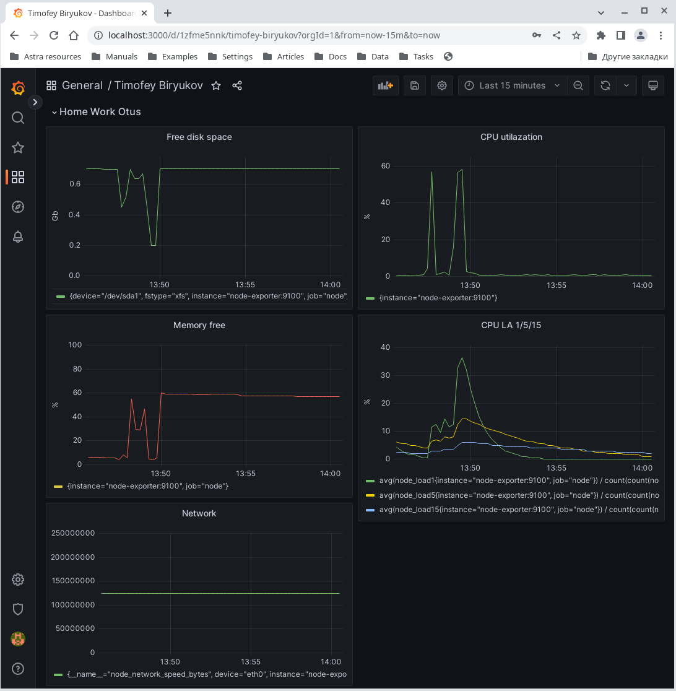

# Домашнее задание к занятию 21 "Prometheus"


## Описание домашнего задания

Настроить дашборд с 4-мя графиками:    
- память;    
- процессор;    
- диск;    
- сеть.    

Настроить на одной из систем:    
zabbix (использовать screen (комплексный экран));    
prometheus - grafana.

В качестве результата прислать скриншот экрана - дашборд должен содержать в названии имя приславшего.

---

## Выполнение     

Был собран стек prometheus-grafana [на docker-compose](./docker-compose.yml) c готовым [дашбордом](./grafana/dashboards/dashboard_Otus.json) под заданные требования.

Использование:    
```bash
# Запуск с пребилдом
docker-compose up -d
docker-compose down
```

Скриншет дашборда:


---

Информационные материлы по заданию:    

https://prometheus.io/blog/2021/11/16/agent/    
https://alexzzz.ru/post/monitoring/    
https://opentelemetry.io/docs/concepts/signals/    
[Презентация](./Otus_Prometheus.pdf)    
