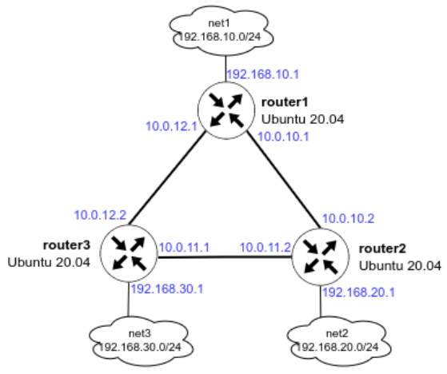

# Домашнее задание к занятию 32 - "Динамическая маршрутизация, OSPF"

## Описание домашнего задания

1. Поднять три виртуалки.    
2. Объединить их разными vlan.    
 2.1 Поднять OSPF между машинами на базе Quagga.    
 2.2 Изобразить ассиметричный роутинг.    
 2.3 Сделать один из линков "дорогим", но что бы при этом роутинг был симметричным.    

    

---

## Выполнение     

Подготовлен [Vagrantfile](./Vagrantfile) c [ansible playbook](ansible/provision.yml) разворачивающий данный стенд.

Использование:    
```bash
vagrant up
```


---

Информационные материлы по заданию:    

[Презентация](docs/iptables_firewalld.pdf)    
[Практика](docs/practic.pdf)

Введение в OSPF - https://q05t9n.wordpress.com/2015/10/01/1-введение-в-ospf/    
[Статья «OSPF»](https://ru.bmstu.wiki/OSPF_(Open_Shortest_Path_First)#.D0.A2.D0.B5.D1.80.D0.BC.D0.B8.D0.BD.D1.8B_.D0.B8_.D0.BE.D1.81.D0.BD.D0.BE.D0.B2.D0.BD.D1.8B.D0.B5_.D0.BF.D0.BE.D0.BD.D1.8F.D1.82.D0.B8.D1.8F_OSPF)    
Статья «IP Routing: OSPF Configuration Guide» - https://www.cisco.com/c/en/us/td/docs/ios-xml/ios/iproute_ospf/configuration/xe-16/iro-xe-16-book/iro-cfg.html    
Документация FRR - http://docs.frrouting.org/en/latest/overview.html    
[Статья «Принципы таблицы маршрутизации. Асимметричная маршрутизация»](http://marshrutizatciia.ru/principy-tablicy-marshrutizacii-asimmetrichnaya-marshrutizaciya.html)     
Документация по Templating(jinja2) - https://docs.ansible.com/ansible/2.9/user_guide/playbooks_templating.html     
