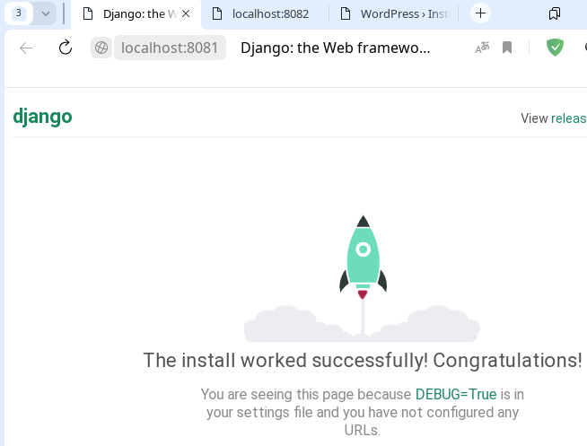
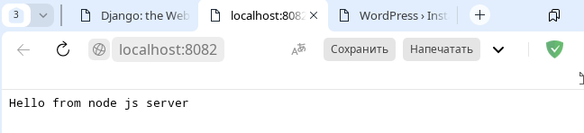
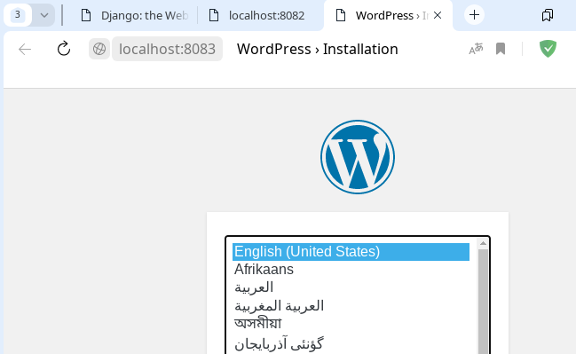

# Домашнее задание к занятию 41 - "Динамический веб"

## Описание домашнего задания


Варианты стенда:    
- nginx + php-fpm (laravel/wordpress) + python (flask/django) + js(react/angular);    
- nginx + java (tomcat/jetty/netty) + go + ruby;     
- можно свои комбинации.

Реализации на выбор:    
- на хостовой системе через конфиги в /etc;    
- деплой через docker-compose.

---

## Выполнение     

Подготовлен [Vagrantfile](./Vagrantfile) и [ansible playbook](./ansible/provision.yml) разворачивающий данный стенд.

Использование:    
```bash
vagrant up
```

Для проверки:    
[http://localhost:8081/](http://localhost:8081/)    
[http://localhost:8082/](http://localhost:8082/)    
[http://localhost:8083/](http://localhost:8083/)    

Скриншоты сервисов после поднятия на стенда:    
    

    

    


---

Информационные материлы по заданию:    

[Презентация](docs/dynamical_web.pdf)    
