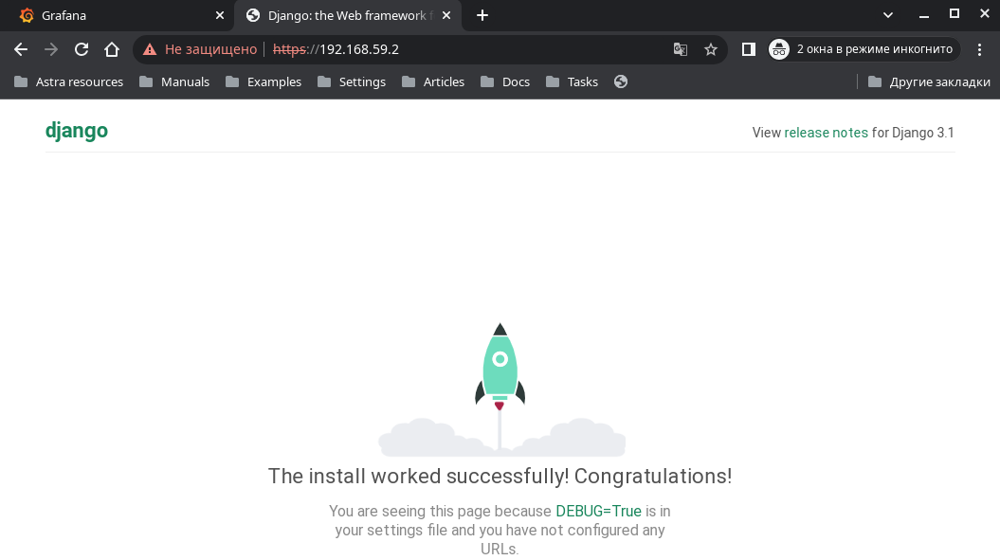

## Курсовой проект 

### Отказоустойчивый кластер веб-приложений с кластерной файловой системой на базе DRBD+NSF, кластеризованной PostreSQL и балансировкой нагрузки.

Должен отвечать следующим требованиям:

- включен https;
- основная инфраструктура в DMZ зоне;
- файрволл на входе;
- сбор метрик и настроенный алертинг;
- включен selinux;
- организован централизованный сбор логов;
- организован backup.


### 1. Описание стенда 

Для развертывания всех компонент системы использован Vagrant, с помощью которого разворачивается стенд, состоящий из 9 виртуальных машин:

- Internet Router с firewall, через который проходят все входящие и исходящие соединения    
- внутренний Router с функциями балансировщика, для равномерного распределения нагрузки по front-end нодам    
- две back-end ноды с кластерной файловой системой, на которой расположено хранилище статических файлов в в виде NFS-кластера и кластер PostgreSQL + Pacemaker    
- две front-end ноды на базе Django+Nginx in Docker, подключены к кластерам NFS и PostgreSQL, обслуживают входящие запросы через балансировщик    
- резервное копирование идет на ноду Backup при помощи Barman для PostgreSQL и Borg для статичского контента расположенного на NFS-кластере    
- мониторинг с алертингом на базе Prometheus + Grafana -> Telegtam    
- на ноду с rsyslog передаются логи со всех нод


---


Использование:    
```bash
vagrant up
```
Фронтенд будет доступен по адресу [https://192.168.59.2](https://192.168.59.2) с сертификатом выписанным на домен exampleprogect.loc.    
    
    


Мноторинг будет доступен на [https://192.168.60.31:3000](https://192.168.60.31:3000).   
    

Алертинг перднастриавается для Телеграм. Необходимо только поменять креды на свои.    
    
    
